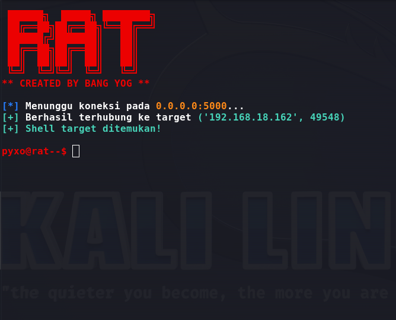

# Remote Tool (Development & Testing Only)

**Penting:** Tools ini hanya untuk tujuan *pengembangan*, *pengujian di lingkungan yang Anda miliki*, atau *pengujian keamanan yang sah* dengan izin tertulis dari pemilik sistem. Jangan gunakan untuk mengakses, mengendali, atau mengirimkan payload ke perangkat yang bukan milik Anda atau tanpa izin eksplisit.

## Deskripsi singkat

Repository ini berisi contoh sederhana server-client untuk tujuan pembelajaran (pengujian jaringan lokal / lab). README ini menjelaskan konfigurasi lokal dan cara menjalankan tool dalam lingkungan terkontrol.

---

## Cara penggunaan (pengujian di lingkungan terkontrol)

1. **Konfigurasi server**

   * Buka `server.py` dan perhatikan fungsi `__init__`:

     ```python
     def __init__(self, lhost="0.0.0.0", lport=5000):
     ```
   * Biarkan `lhost` sebagai `0.0.0.0` jika Anda ingin server menerima koneksi dari berbagai IP di jaringan lokal. Ganti `lport` sesuai kebutuhan (pastikan port terbuka/tersedia).

2. **Konfigurasi client**

   * Buka `client.py` dan perhatikan fungsi `__init__`:

     ```python
     def __init__(self, rhost="192.168.18.162", rport=5000):
     ```
   * Isikan `rhost` dengan alamat IP mesin server (alamat yang dapat dijangkau dari client). Pastikan `rport` sama dengan `lport` pada `server.py`.

3. **Menjalankan (di lab / mesin milik sendiri)**

   * Jalankan `server.py` pada mesin yang Anda gunakan sebagai server:

     ```bash
     python3 server.py
     ```
   * Jalankan `client.py` pada mesin client (dalam jaringan yang sama) untuk menghubungkan ke server:

     ```bash
     python3 client.py
     ```
   * Tunggu hingga client berhasil terhubung ke server. Jika koneksi berhasil, ikuti menu perintah yang tersedia pada server.

4. **Distribusi & konversi executable**

   * **Hanya** lakukan konversi ke executable (mis. menggunakan `auto-py-to-exe`) untuk keperluan pengujian di mesin yang Anda miliki atau memiliki izin. Jangan gunakan metode ini untuk menyebarkan ke perangkat orang lain tanpa izin.
   * Jika ingin membuat binary untuk pengujian, gunakan tool yang Anda percayai dan jalankan hasilnya hanya di lingkungan terkontrol.

5. **Menu dan perintah**

   * Setelah koneksi berhasil, server akan menampilkan menu perintah (lihat implementasi di `server.py`). Pastikan Anda mengerti fungsi tiap perintah sebelum menggunakannya pada mesin uji.

---

## Tips debugging

* Periksa alamat IP dan port pada kedua sisi (server & client).
* Pastikan firewall atau aturan jaringan tidak memblokir port yang dipakai.
* Untuk pengujian lokal, Anda bisa menggunakan `localhost` atau 127.0.0.1 untuk memastikan alur bekerja.
* Cek log/console untuk pesan error.

---

## Etika & Kepatuhan

* Hanya gunakan tools ini pada perangkat yang Anda miliki atau jika Anda memiliki izin tertulis dari pemilik.
* Gunakan tool ini untuk belajar, pengujian, atau riset keamanan yang etis.
* Pelanggaran hukum atau akses tanpa izin adalah tanggung jawab pengguna dan dapat berakibat hukum.

---


